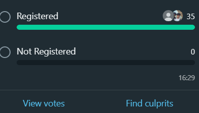

# WhatsApp Poll Member Comparison Extension

A Chrome extension that compares WhatsApp group members who have participated in a poll with a user-provided list. It identifies members who have not voted in the poll.
## Features


- **Easy Comparison:** Compare WhatsApp group members who voted in a poll with a user-provided list.
- **Unvoted Members:** Displays the names of members who have not voted.
- **File Support:** Upload user lists in CSV or text file format.
- **Efficient:** Helps group admins easily track poll participation.
## Installation

### 1. Clone or Download the Repository

To get started, clone the repository:

```bash
git clone https://github.com/yourusername/whatsapp-poll-member-comparator.git
```
## Usage

1. **Click** on the extension icon in your browser toolbar.
2. **Upload** a list of users in CSV or text format.
3. **Paste** the poll results from your WhatsApp group.
4. The extension will show a list of **members who haven’t participated** in the poll.
## File Format for User List

The extension accepts user lists in **CSV**. The list should contain one name per line or be comma-separated.

### Example CSV Format:
Name,Phone
John Doe
Jane Smith
Alice Johnson
Bob Brown

## How It Works
currently it is developed for static files soon to be dynamic.
1. The extension **parses** the WhatsApp poll results.
2. It compares the names of **polled members** with the provided list of users.
3. It displays a list of **unvoted members**, i.e., those not included in the poll results.

## Contributing

We welcome contributions to improve the extension! If you want to contribute, follow these steps:

1. **Fork** the repository.
2. **Create a new branch**: `git checkout -b feature-name`.
3. **Make your changes** and commit them: `git commit -am 'Add new feature'`.
4. **Push your branch**: `git push origin feature-name`.
5. **Create a pull request** from your branch.
## License

This project is licensed under the **MIT License**. See the [LICENSE](LICENSE) file for details.

## Acknowledgements

- Thanks to the open-source community and contributors for their valuable tools and libraries.
